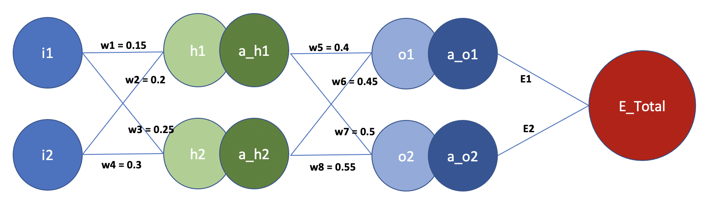
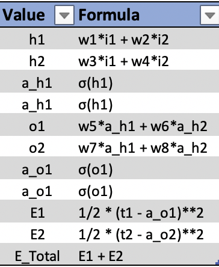
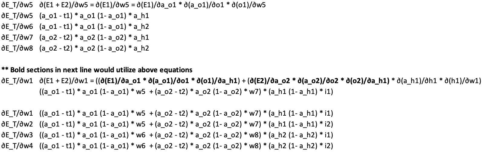
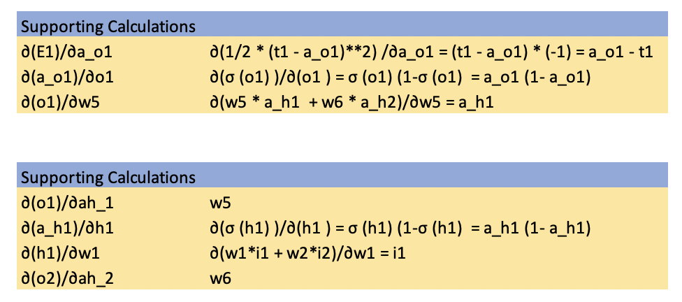
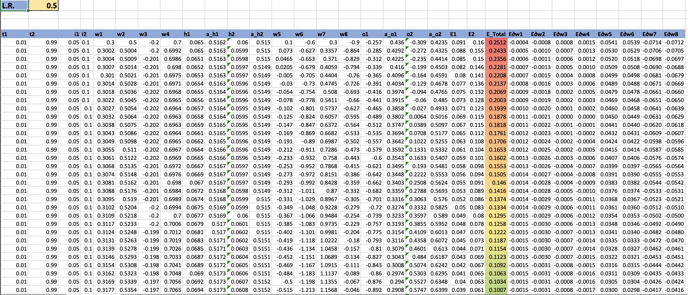
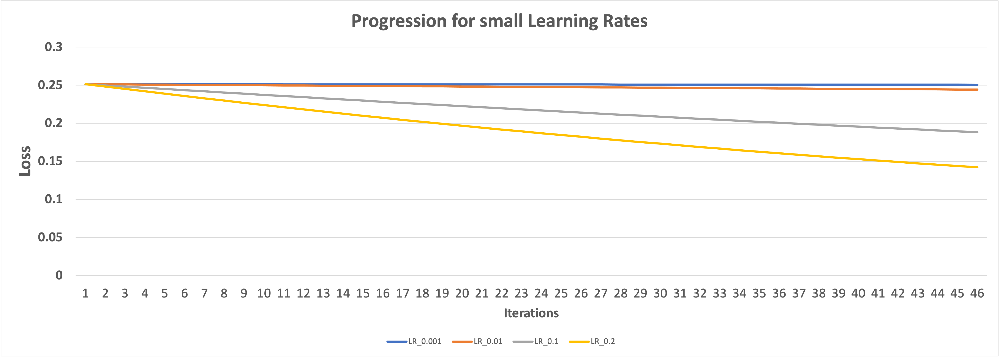
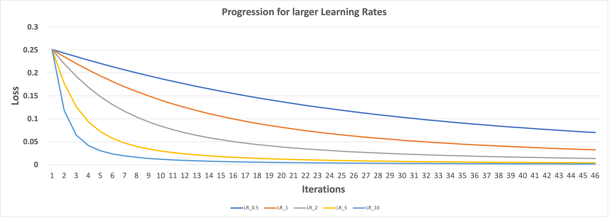

# TSAI-END2 - BackPropagation explained through Excel

We used Excel to understand :-
<ul>
  <li><a href="#step1"> How the formula for each neuron is calculated? </a></li>
  <li><a href="#step2"> How the gradients are calculated with respect to each weight? </a></li>
  <li><a href="#step3"> How the weights are dynamically updated? </a></li>
  <li><a href="#step4"> How the learning rate effects the ability to optimize the loss faster? </a></li>
</ul>

<b> You can refer to the final excel sheet in the folder </b>  
The neural network we are using is  

From the diagram,  
* We have two inputs i1 and i2
* We have two outputs o1 and o2
* We have two neurons in the hidden layer h1 and h2
* w1, w2, w3, w4, w5, w6, w7, w8 are the weights used
* sigmoid is the activation function used to convert h1, h2, o1 and o2 to a_h1, a_h2, a_o1 and a_o2 respectively

 <h1 id="step1"> Formulas for each neuron </h1>
 
 

 <h1 id="step2"> Derivatives Calculations </h1>

 

 
 
 <h1 id="step3"> Calculating the new weights for the next iterations </h1>
 
 The weight update utilises the chain rule so that it can calulate the gradients, update the weights and minimize the loss  
 For getting the weights of a new iteration, We need 
 * weights of the previous iteration
 * learning rate
 * rate of error with respect to that particular weight
 
 
  
 <h1 id="step4"> Loss Progression with different Learning Rates </h1>

We tried to see how swiftly the loss is minimized by changing the Learning Rate and the results are shown in the images below:

 

 

Please feel free to refer to the Excel sheet in the repo to understand the diagrams, calculations and formulas used.
